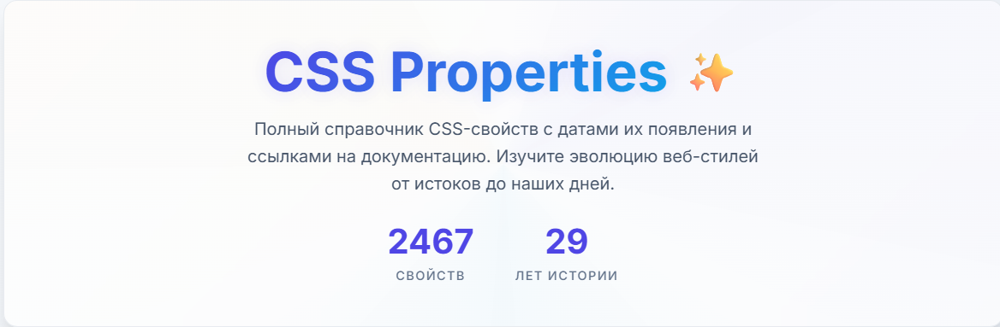

<div align="center">
    
</div>

# css-properties
Все CSS-свойства и медиавыражения в одном месте. 
Основная задача проекта собрать в одном месте все CSS-свойства, медиавыражения и значения с сортировкой по выходу в браузерах. 

## Для контрибьютеров
[Почитайте небольшой документ как правильнее контрибьютить в проект.](./CONTRIBUTING.md)

## Как запустить проект
1. Установить node.js. Поддерживаемая версия 20
2. Установить зависимости проекта
```bash
pnpm i
```
3. Запустить проект
```bash
pnpm dev
```

## Структура проекта
- `src` - файлы для сборки сайта: шаблонизаторы, компоненты, данные;
- `dist` - автогенерируемые файлы для сайта (прод);
- `файлы в корне` - конфигурационные файлы проекта.
